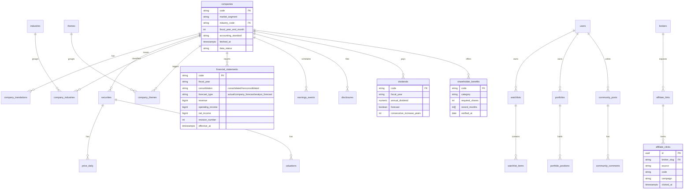

# ER図（目標データモデル）

Phase 1 はサンプル JSON で動作しますが、実運用（Supabase/PostgreSQL）では以下の ER を目標とします。中核部分のみ抜粋。

## 全データ共通の来歴カラム

重要データ（企業・株価・財務・配当・優待・開示）は次を保持し、実データ誤認・古い値の混入・訂正履歴喪失を防ぐ:

`source_id` / `source_url` / `fetched_at` / `verified_at` / `effective_at` / `published_at` / `data_status`(sample/verified/unverified/stale) / `revision_number`

コーポレートアクション（証券コード変更・上場廃止・商号変更・合併・分割・併合・決算期変更・会計基準変更・訂正開示）は `corporate_actions` で履歴管理し、時系列の再計算を可能にする。
